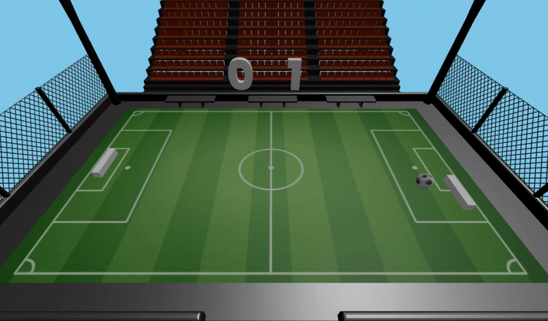
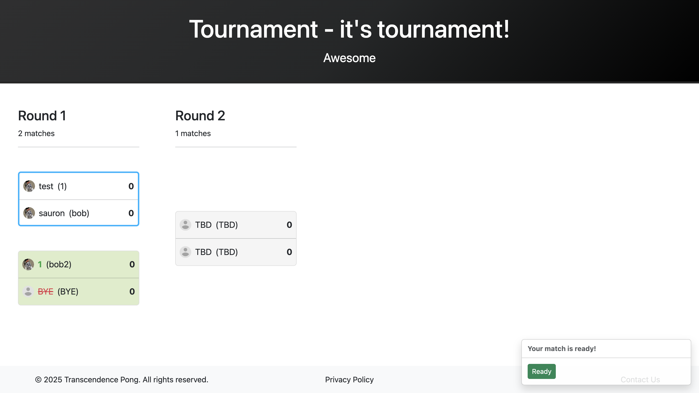
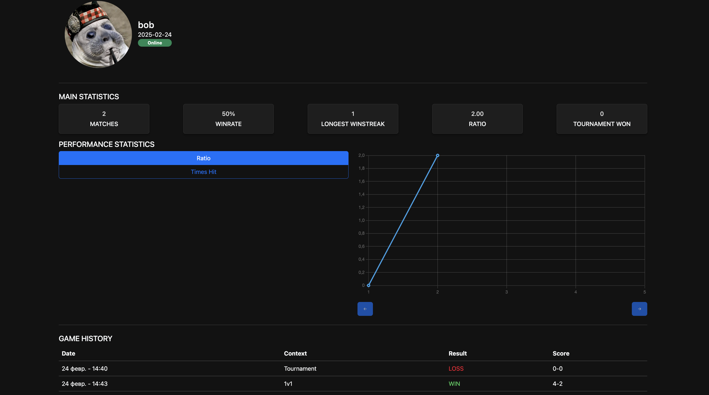
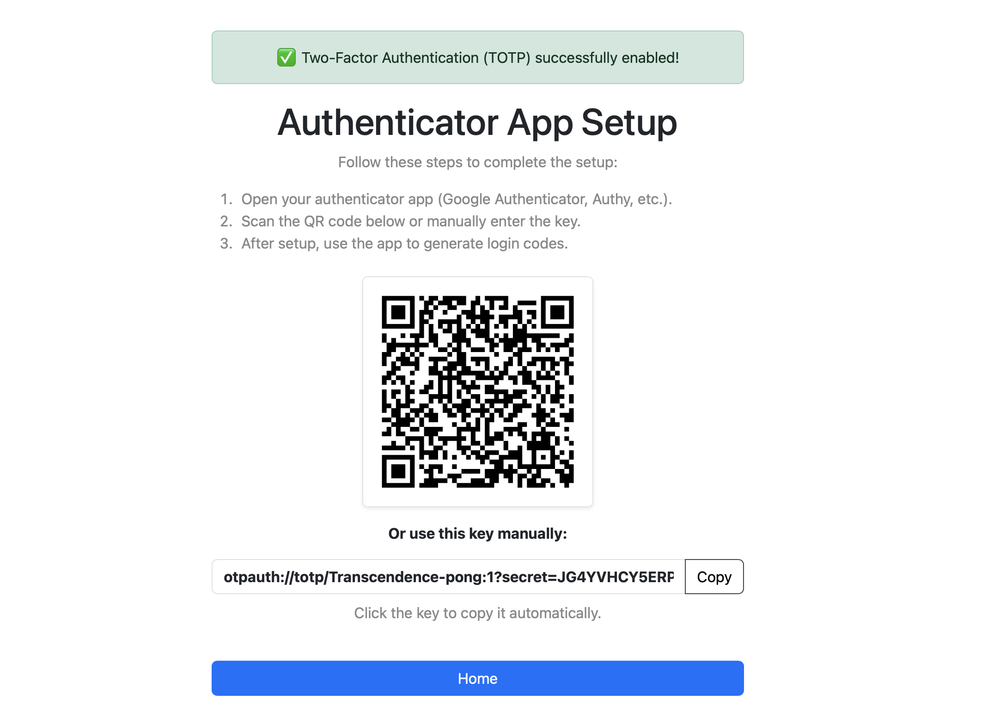
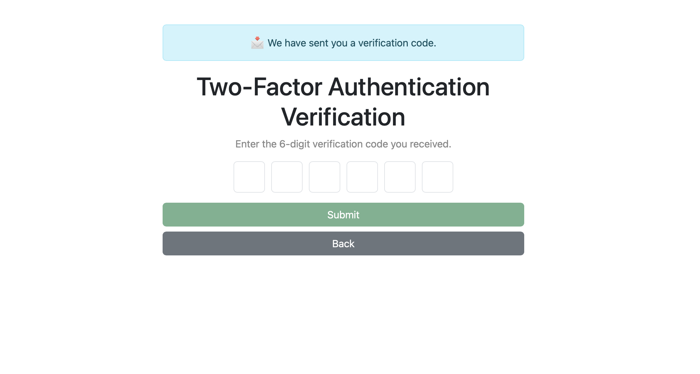

# ft_transcendence

## 📌 Project Description
**ft_transcendence** is a full-stack web application. This project involves designing, developing, and organizing an interactive platform with AI integration, real-time multiplayer features, and secure authentication mechanisms.

## 🚀 Features

- Multiplayer **Pong** game with real-time interaction
- **AI opponent** for solo gameplay
- **Blockchain integration** for tournament score storage
- **Two-Factor Authentication (2FA)** for enhanced security
- **3D graphics** powered by Three.js/WebGL
- **User dashboards** with game and performance statistics
- **GDPR compliance** with user anonymization and data management

## 🛠️ Installation Instructions

1. Clone the repository:
   ```sh
   git clone https://github.com/ismaelmehdid/transcendence

2. Navigate to the project directory:
   ```sh
   cd transcendence

3. Compile the project:
   ```sh
   cd transcendence

## 💻 Usage

1. Open the website in your browser using this link:
   ```sh
   https://transcendence-pong:7443
2. Allow the self-signed certificate.
3. Register an account.
4. Start playing!

## 🖼️ Project Gallery

| Gameplay | Tournament | Stats Dashboard |
|----------|-----------|-----------------|
|  |  |  |

| Two-Factor Authentication (Step 1) | Two-Factor Authentication (Step 2) |
|------------------------------------|------------------------------------|
|  |  |

🏗️ Tech Stack

| Component | Technology                                |
|-----------|---------------------------------------------|
| Web server        | NGINX |
| Backend framework        | Django |
| Frontend framework        | Bootstrap, JavaScript |
| Database        | PostgreSQL |
| Blockchain        | Ethereum (Solidity)  |
| 3D Rendering        | ThreeJS/WebGL |
| Cache        | Redis |

## 🔥 Major Features

| Feature | Description                                |
|-----------|---------------------------------------------|
| Backend framework        | Django-based API |
| Blockchain integration        | Tournament score storage using Ethereum |
| User management | Authentication, authorization, and user profiles |
| Multiplayer support        | Real-time remote player matches |
| AI opponent        | Play against an AI-controlled paddle |
| Security        | Two-Factor Authentication (2FA) with JWT |
| Advanced 3D graphics        | Realistic rendering with Three.js/WebGL |

## 📋 Minor Features

| Feature | Description                                |
|-----------|---------------------------------------------|
| Database | PostgreSQL backend |
| Frontend UI        | Bootstrap-based responsive design |
| Stats Dashboard        | User and game performance analytics |
| GDPR Compliance        | User anonymization, data export, account deletion |
| Cross-browser compatibility        | Optimized for multiple web browsers |

## 👥 Authors
- [imehdid](https://github.com/imehdid)
- [asyvash](https://github.com/redarling)
- [mbriand](https://github.com/maxbriand)

